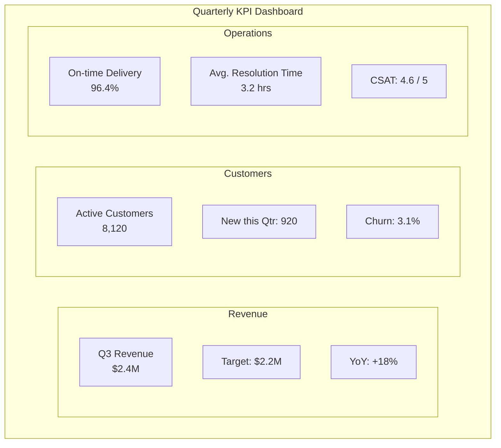
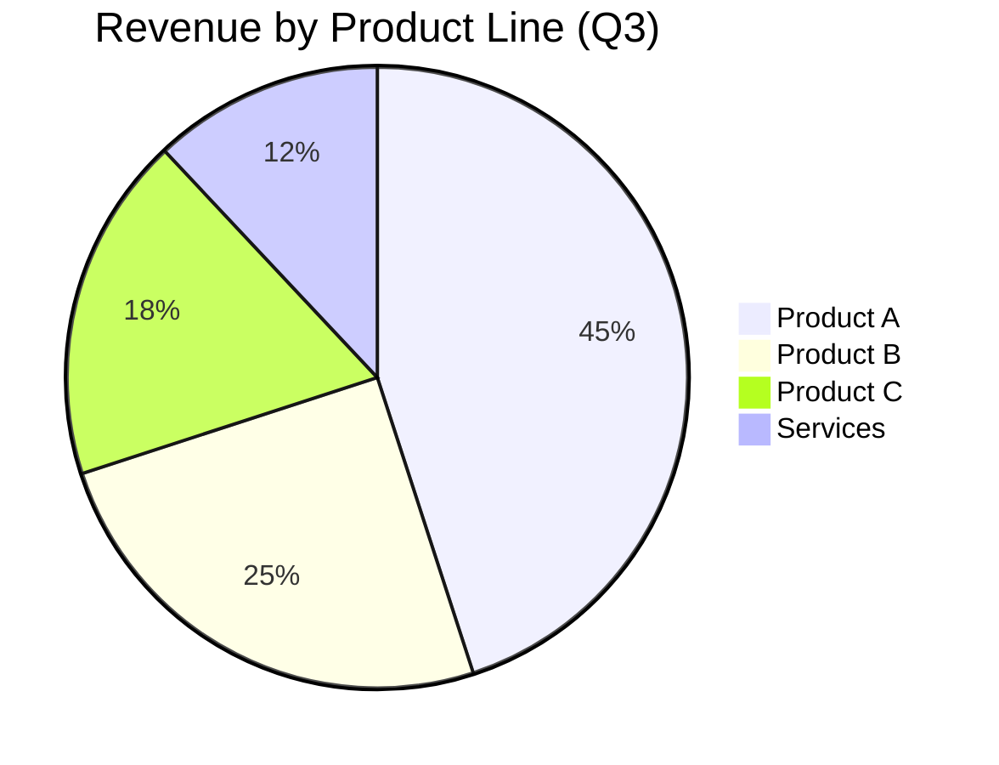
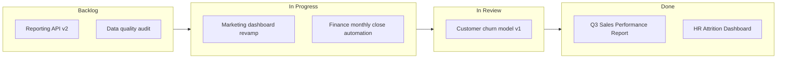
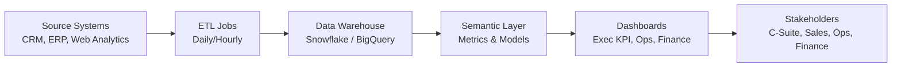
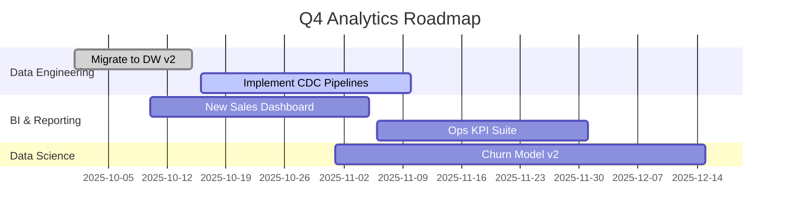
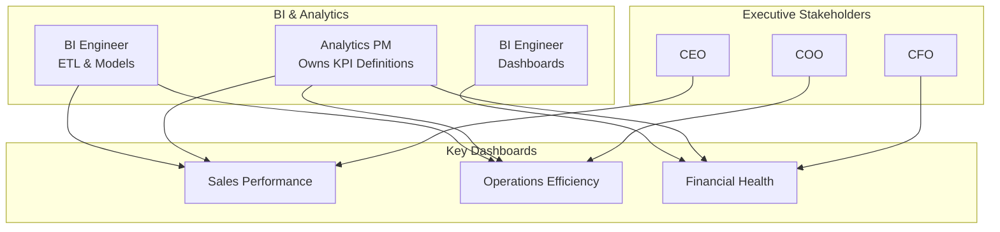

Nice, let’s build a little gallery of “visual reports & dashboards” using Mermaid. I’ll give you copy-pasteable code blocks you can drop into any Mermaid-enabled environment (like many markdown editors, docs tools, etc.).

---

## 1. KPI Summary Dashboard (Simple “Scorecard” Layout)

Mermaid doesn’t do full visual tiles, but you can fake a KPI panel using a flowchart with groups:



You can tweak labels to match your real metrics.

---

## 2. Sales Report – Funnel + Stage Conversion

Good for a “pipeline” style visual in a report:

```mermaid
flowchart TD
    A[Leads\n12,000] --> B[Qualified\n4,800\n(40% of Leads)]
    B --> C[Opportunities\n1,150\n(24% of Qualified)]
    C --> D[Proposals Sent\n620\n(54% of Opps)]
    D --> E[Closed Won\n230\n(37% of Proposals)]
    D --> F[Closed Lost\n390]

    classDef strong fill:#fff,stroke:#333,stroke-width:2px;
    class A,B,C,D,E,F strong;
```

(If your renderer doesn’t support `classDef` styling, you can just remove the last two lines.)

---

## 3. Product Mix Report – Pie Chart

Quick “share of total” report:



Values are usually treated as proportions; they don’t have to sum to 100.

---

## 4. Project Status Dashboard (Kanban-style Board)

Use Mermaid’s `flowchart` to simulate a Kanban board for a status dashboard:



Nice for “project portfolio” slides.

---

## 5. Executive Report – End-to-End Data Flow

Show where numbers in your dashboard come from:



Great for a “how this report is built” slide or documentation.

---

## 6. Time-based Report – Release / Project Roadmap (Gantt)

For roadmap or milestone reports:



You can drop in your real dates and tasks.

---

## 7. Customer Journey / Conversion Dashboard View

Represent key conversion steps with annotated metrics:

```mermaid
flowchart LR
    A[Site Visits\n120k] --> B[Signup Page\n35k (29%)]
    B --> C[Account Created\n18k (51%)]
    C --> D[First Purchase\n7.2k (40%)]
    D --> E[Repeat Purchase\n2.9k (40%)]

    click A "https://your-analytics-link.example/visits" "View visit details"
    click E "https://your-analytics-link.example/retention" "View retention report"
```

The `click` lines add hyperlinks in some Mermaid environments (optional).

---

## 8. Team Performance Dashboard Overview (Org + KPIs)

Overlay people & ownership on metrics:



Use this in documentation to show “who owns what”.

---

## How you can extend this

* Replace dummy numbers with your real metrics.
* Wrap related visuals into one markdown document as a “report pack.”
* For interactive docs, add `click` links on nodes to jump to detailed dashboards or queries.

If you tell me:

* what domain (sales, HR, ops, product, etc.), and
* what 3–5 metrics you care about,

I can tailor a small, cohesive Mermaid “report set” just for that scenario.
